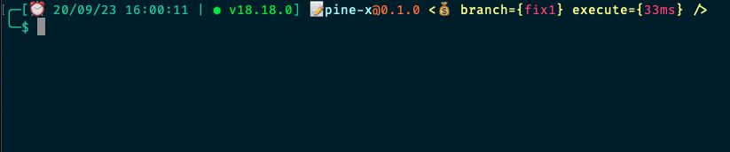

# Dotfiles

## Install

- Install [Oh My Zsh](https://ohmyz.sh/)

```bash
curl https://raw.githubusercontent.com/hunghg255/dotfiles/master/install.sh | sh
```

## Terminal Custom

- Show version
- Show time
- Show excecution time commands
- Icon funny


